# PCAP Network Packet Capture Analysis using Wireshark

---

## 📌 Overview
This project focuses on network forensics and incident response by analyzing packet capture (PCAP) files to identify malicious activity and reconstruct attack timelines.

- Performed deep packet inspection using Wireshark
- Applied forensic investigation workflow
- Identified attacker techniques and artifacts
- Reconstructed attack timeline 
- Delivered a forensic report with evidence-backed findings

---

## 📰Case Description
**Scenario**: 
- Lily Tuckrige, a Chemistry teacher at XYZ School, reported receiving
harassing emails on her personal email (lilytuckrige@yahoo.com).
- She suspects the perpetrator is a student from her Chemistry 109 summer course.

**Role**: 
- Security Administrator, XYZ School

**Evidence Chain**:
- Initial Evidence:
  - Tuckrige provided screenshots of the harassment.
  - Full Message Headers were later retrieved, revealing the originating IP address: 140.247.62.34.

- Infrastructure Findings:
  - The IP maps directly to a specific XYZ School student dorm room.
  - The room is occupied by three students: Alice, Barbara, and Candice.
  - Security Vulnerability: A non-sanctioned, unencrypted (no password) Wi-Fi router was installed by Barbara's boyfriend in the room, meaning anyone within physical proximity could have utilized the connection.
  
- Active Surveillance: 
  - A network sniffer was placed on the room’s Ethernet port to log all incoming and outgoing packets.

- The Incident (Monday 7/21):
  - A new harassing message was sent via willselfdestruct.com, an anonymizing service that deletes content after viewing, bypassing traditional email trail retention.
    
**Goal**:
- Identify if a Chemistry 109 student sent the emails using conclusive
evidence

**Investigation Assets**: 
- Screenshots: The original harassment and the Yahoo Mail headers.
- Network Logs: Raw packet captures (PCAP) from the Ethernet tap on the day of the incident.
- Class Roster: The official list of students enrolled in Chemistry 109.
  
---

## 🛠️ Tools & Technologies
- Wireshark v 4.4.3: Network traffic analysis professionals consider this tool as their most reliable observation platform
- platform:  Windows 10 Pro (64-bit), processor:  Intel(R) Core(TM) i3 RAM: 12 GB
- TCP/IP, DNS, HTTP, HTTPS
- PCAP Analysis Techniques
- Network Forensics Methodologies
  
---

## 🔍 Methodology
1. Imported PCAP files into Wireshark
2. Applied filters to isolate suspicious traffic: http, dns, tcp.stream
3. Followed packet streams to reconstruct sessions
4. Identified anomalies in DNS queries and HTTP requests/responses
5. Extracted artifacts such as malicious domains, suspicious IP addresses and payload indicators
6. Documented findings for reporting
   
---

## ⚙️ Investigation Steps (With evidence)

1. **Initial Traffic Analysis**:
- Loaded PCAP into Wireshark
- Reviewed capture summary (duration, packets, size): erified file integrity using SHA256/SHA1 hashes and established the capture timeframe.
  
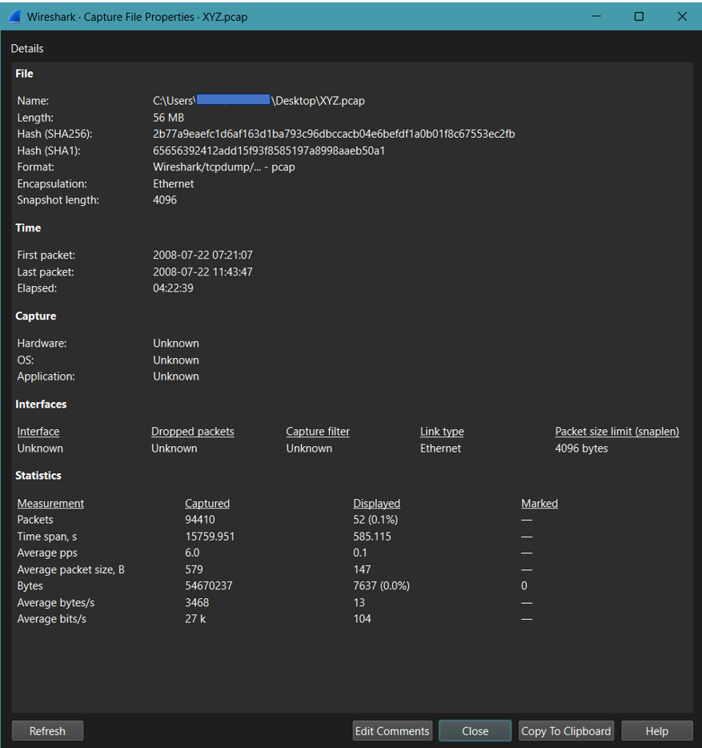

*Figure 1: Verification of PCAP integrity using SHA hashes and capture property summary.*

 

2. **Identified active devices**:
- Used Statistics → Endpoints
- Identified 192.168.15.4 as highest traffic generator (suspect)
  
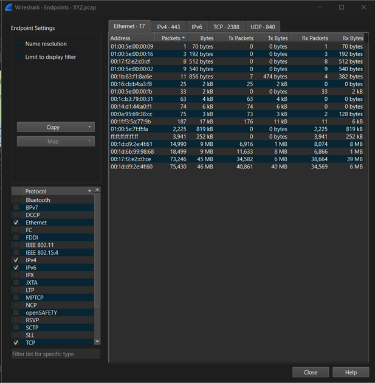

*Figure 2: Ethernet endpoint statistics identifying 192.168.15.4 as the primary traffic generator.*

 

3. **Applied protocol filters**:
- tcp → general traffic
- http → web activity
- dns → domain queries

 

4. **Focused on suspect device**:
- ip.addr == 192.168.15.4
- Tracked all incoming & outgoing traffic
  
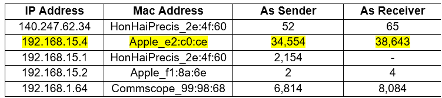

*Figure 3: Filtered traffic stream isolating all communications for the suspect host.*

 

5. **Analyzed web activity**:
- http && ip.addr == 192.168.15.4
- Observed normal browsing:
  - Google searches
  - YouTube access
  - Amazon browsing

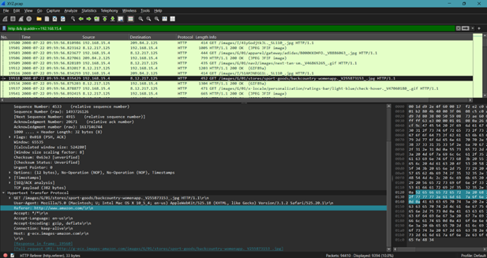

*Figure 4: Analysis of HTTP requests revealing the suspect's browsing patterns.*

 

6. **Network Infrastructure Reconstruction**:
- Visualized the communication flow between the suspect, the router, and external services (Amazon, Google, etc.).

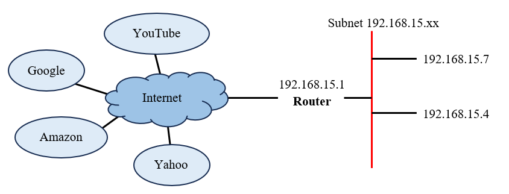

*Figure 5: Reconstructed logical network topology mapping the suspect to the gateway.*

 

7. **Investigated DNS behavior**:
- Identified suspicious domain requests to:
  - sendanonymousemail.net
  - willselfdestruct.com

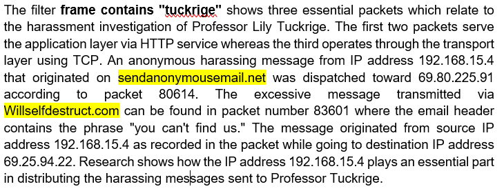

*Figure 6: Suspicious domain requests to known anonymous email relay services.*

     
 
8. **Content-Based Filtering**:
- Applied keyword filters:
  - frame contains "send+anonymous"
  - frame contains "tuckrige"
  - frame contains "mail"
- Revealed email-related activity linked to the victim

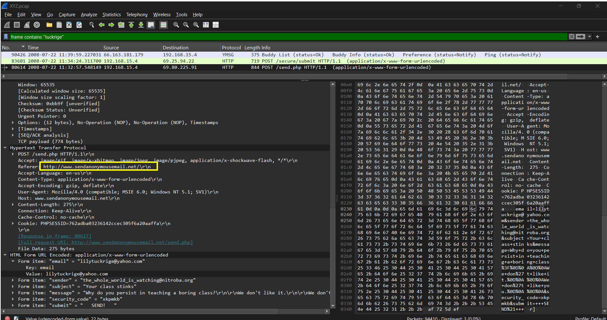

*Figure 7: Keyword search identifying HTTP traffic related to anonymous email platforms.*

 

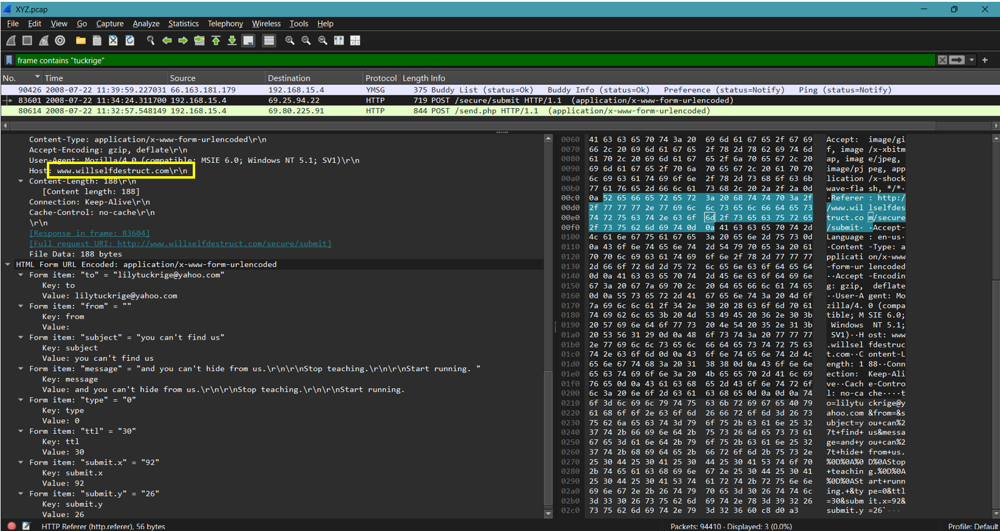

*Figure 8: Payload analysis confirming the delivery of the "willselfdestruct" message.*

 

9. **Tracked communication with external IP**:
- ip.addr == 140.247.62.34
- Linked to harassment target (via router)

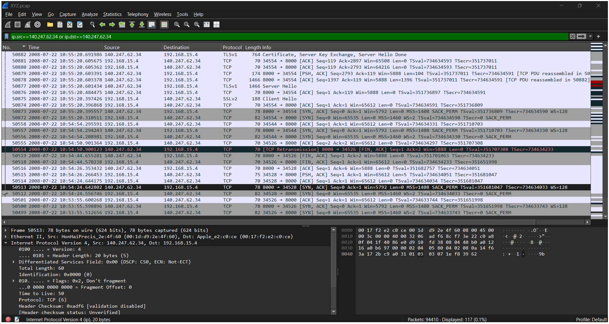

*Figure 9: Traffic logs connecting the suspect to the victim's external IP address. (140.247.62.34).*
  
 

10. **Evidence Correlation**:
- Gmail account identified
- Anonymous messaging activity confirmed
- User intent observed via search behavior

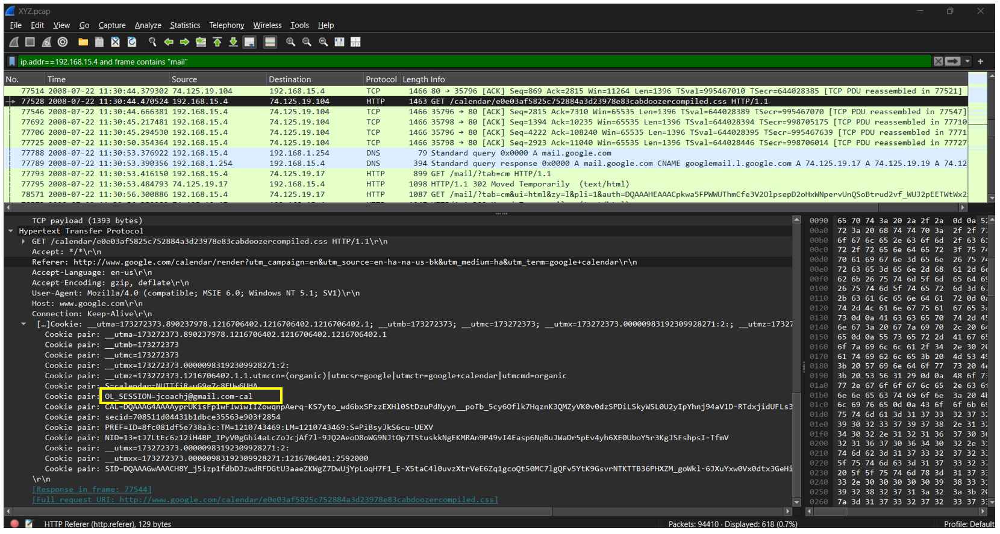

*Figure 10: Correlation of session cookies and headers revealing the culprit’s Gmail identity.*
  
 

11. **Timeline Reconstruction**:
- Based on:
  - Packet numbers
  - HTTP referers
  - Timestamps
- Observed flow:
  - Yahoo search → Google search → YouTube → Amazon
  - Then suspicious activity: Transition to anonymous email activity

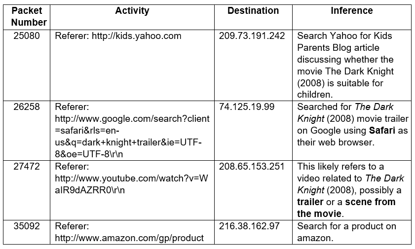

*Figure 11: Chronological sequence of events from benign browsing to the harassment incident.*

---

## 📊 Key Findings

1. **File Security & Timeframe**:
   
- Verified MD5, SHA1, and SHA256 checksums for forensic integrity.
- Captured data spans July 22, 2008, 01:51 - 06:13 UTC.
  
2. **Network Details**:
   
- 17 devices identified on the subnet 192.168.15.XX.
- Gateway IP: 192.168.15.1; Suspect IP: 192.168.15.4 (Apple device).

3. **Investigation Findings**:
   
- Harassing emails sent via sendanonymousemail.net and willselfdestruct.com.
- Email trace linked to jcoachj@gmail.com (Packet #77528).
- Searches by the suspect: “want to harass my teacher.”
  
4. **Key Technical Evidence**:
   
- Filters applied: ip.addr == 192.168.15.4 and frame contains "tuckrige".
- Virtual Machine detected: Windows XP (via Apple hardware).
  
5. **Identification**:
   
- Logs confirm suspect is Johnny Coach, Chemistry 109 student.
- Connection to nitroba.org, origin of initial harassing emails.
  
---

## 🧠 Skills Demonstrated
- Network Traffic Analysis
- Packet Inspection (Wireshark)
- Incident Investigation & Timeline Reconstruction
- Analytical Thinking & Problem Solving
- Technical Reporting & Documentation
  
---

## 🛡️ Mitigation Recommendations
- Implement network monitoring and alerting systems
- Block malicious IPs and domains
- Apply DNS filtering and logging mechanisms
- Enforce firewall rules and segmentation
- Use IDS/IPS for real-time detection
- Regularly update and patch systems
- Regular security monitoring and log analysis
  
---

## 👩‍🎓Team Members
- Gayathmee Kiveka
- Minsadhi Vihasna

---

## 🎓 Academic Note
This project was developed as part of the Bachelor of Information Technology (Cybersecurity specialization) and is intended for academic and educational purposes.

[!IMPORTANT]
To maintain academic integrity and protect the privacy of team members and institutional data:
- **Redacted Information:** Sensitive identifiers, team member personal details, and internal institutional data have been omitted.
- **Partial Documentation:** Only specific forensic artifacts and methodology summaries are presented here to showcase technical proficiency.
- **Full Report:** The complete Forensic Report and original PCAP files are available for review upon request during formal interviews.

---

## 📄 License  
This repository is provided for **academic use only**.  

